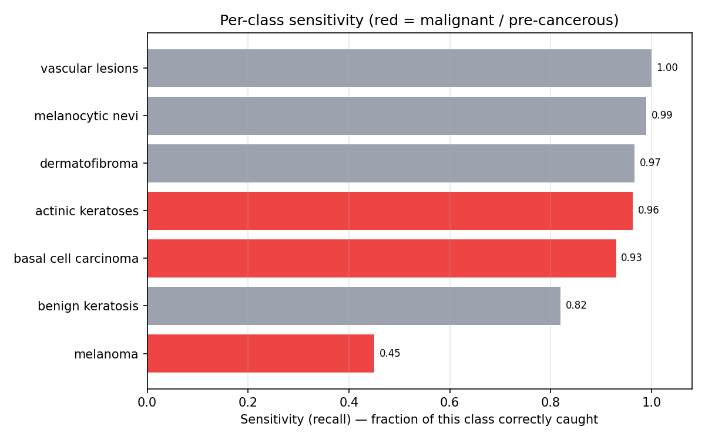
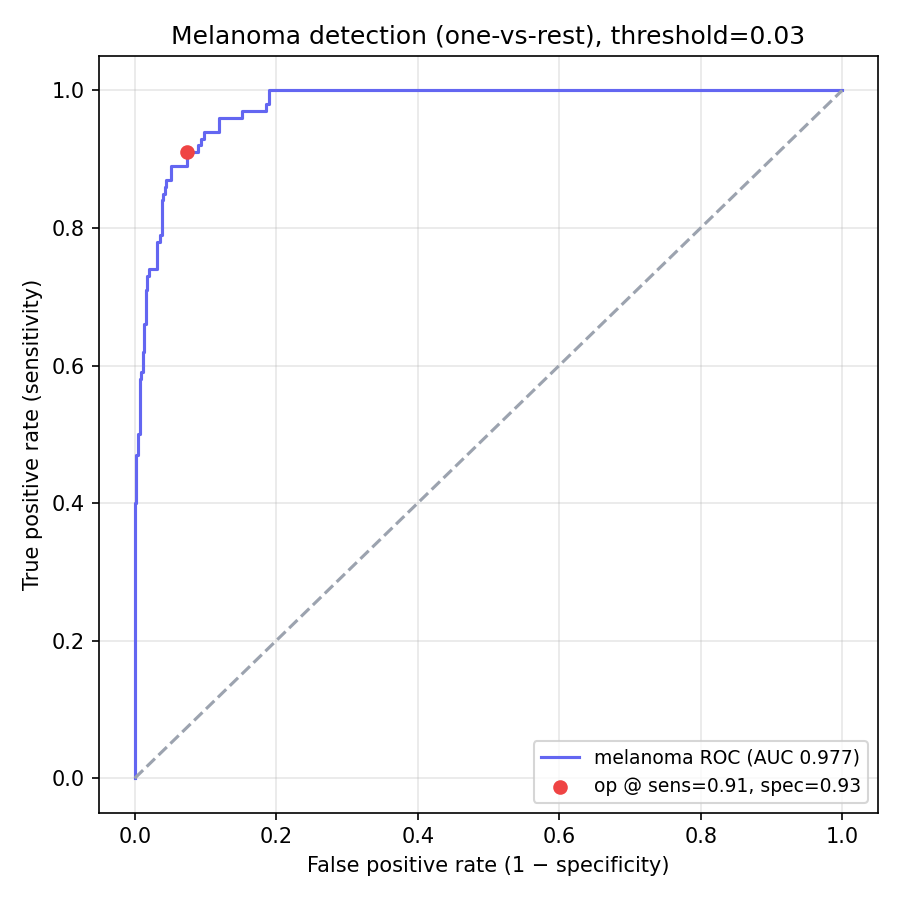
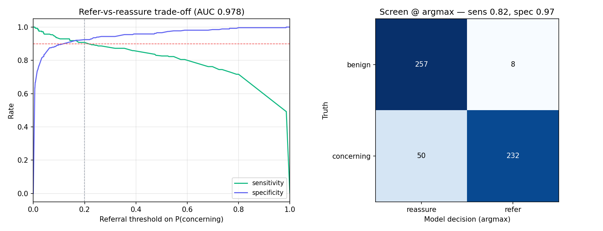
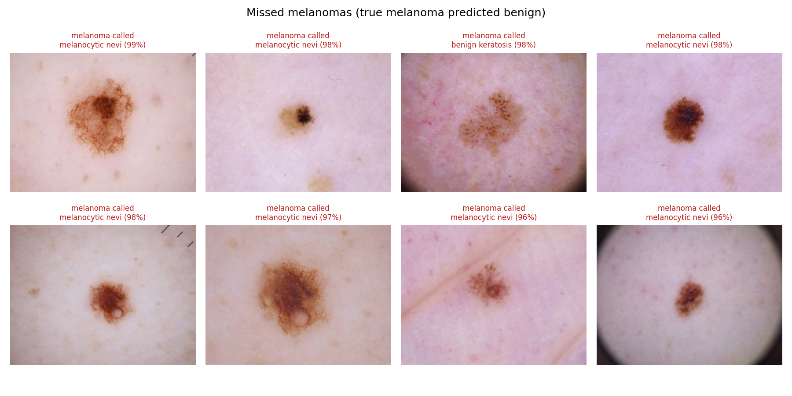

# Clinical reality check — skin lesion classifier

**Model: EfficientNet-B3 @ 300px** — the state-of-the-art checkpoint in this repo
(`results/archive_efficientnet_b3/`). Evaluated on 547 local validation images;
**balanced accuracy 0.874, 95% CI [0.852, 0.896]**.

**One-line takeaway:** even this strong model — which ranks melanomas almost
perfectly (**melanoma AUC 0.977**) — catches only **45% of melanomas at its
default argmax decision rule**, calling **44 of 100 melanomas benign**. The signal
is excellent; the *decision threshold* is the problem. Re-tuning it to a clinical
operating point recovers **91% melanoma sensitivity at 93% specificity**.

> ⚠️ Research/education demo, **not medical advice.** Local val balanced accuracy
> (0.874) is below the ~0.955 reported at training time because this uses a fixed
> local `data/val` subset, not the Kaggle training split — the *relative* clinical
> story is what matters. Generated by [`08_clinical.py`](08_clinical.py);
> regenerate for any checkpoint with `SKIN_MODEL_DIR=<dir> uv run python 08_clinical.py`.

---

## Why a separate report?

Balanced accuracy weights all seven classes equally. A clinic does not: **missing
a melanoma is far more costly than confusing two benign lesions.** This report
re-scores the *same* model through that lens — per-class sensitivity, melanoma
detection as a screening problem, and the dangerous misses.

---

## 1. Per-class sensitivity — strong everywhere except where it matters most

Sensitivity = "of all true cases of this class, what fraction did we catch?"
The model is excellent on six of seven classes — and a glaring outlier on the
single deadliest one:

| Class | Risk tier | Sensitivity |
|---|---|---|
| **melanoma** | malignant | **0.45** ⚠️ |
| benign keratosis | benign | 0.82 |
| basal cell carcinoma | malignant | 0.93 |
| actinic keratoses | pre-cancerous | 0.96 |
| dermatofibroma | benign | 0.97 |
| melanocytic nevi | benign | 0.99 |
| vascular lesions | benign | 1.00 |

Melanoma is the hardest class *and* the most dangerous to miss. The 7-way argmax
rarely picks it, so under the default rule more than half of melanomas slip
through — even though, as §2 shows, the model actually *knows* which lesions are
suspicious.

---

## 2. Melanoma detection is a *threshold* problem, not a *model* problem

Treating melanoma as one-vs-rest, the **ROC AUC is 0.977** — near-perfect ranking
of melanomas above non-melanomas. The signal is there. The only issue is the
argmax decision rule, which yields just 0.45 sensitivity.

Lower the melanoma threshold to **0.029** and you reach **91% sensitivity at 93%
specificity** (catch 91/100 melanomas; only 9 missed), at a precision of 0.73.
That is a deployable screening operating point — and it required *no retraining*,
only a threshold change.

| Decision rule | Melanoma sensitivity | Specificity |
|---|---|---|
| Default argmax | 0.45 | very high |
| Threshold tuned to ≥90% sensitivity | 0.91 | 0.93 |

---

## 3. "Refer or reassure?" — the screening view

Collapse the 7 classes into **concerning** (melanoma, basal cell carcinoma,
actinic keratoses) vs **benign** — *should this lesion see a doctor?* Separation
is excellent (**AUC 0.978**):

| Rule | Sensitivity (catch concerning) | Specificity | PPV |
|---|---|---|---|
| Argmax | 0.82 | 0.97 | 0.97 |
| Tuned to ≥90% sensitivity | 0.91 | 0.92 | 0.93 |

B3's argmax screen is already respectable (0.82 sensitivity), and a modest
threshold shift buys 90%+ sensitivity for only ~5 points of specificity. This is
the safe operating regime.

---

## 4. The dangerous misses

The 44 melanomas the model called benign. The dominant confident-error pair, from
the calibration analysis, is unambiguous:

- **melanoma → melanocytic nevi: 33 cases**
- melanoma → actinic keratoses: 9 cases

Melanomas confidently mistaken for ordinary moles. These are *confident* errors,
not unsure ones, so a plain confidence threshold would not flag them — which is
exactly why a melanoma-specific operating point (§2) is the right lever.
Inspecting these images is the natural next step (genuinely hard cases?
amelanotic melanoma? label noise?).

---

## What to do about it

1. **Don't ship argmax.** Adopt a melanoma / concerning-lesion threshold from
   §2–§3 tuned to ≥90% sensitivity. This alone takes melanoma recall from 0.45 to
   0.91 with no retraining.
2. **Report sensitivity, not just balanced accuracy**, when costs are asymmetric.
   Balanced accuracy 0.87 looked great; melanoma sensitivity 0.45 did not.
3. **Targeted recall work** if thresholding is not enough: more melanoma
   augmentation, melanoma-weighted loss, or a dedicated melanoma-vs-rest head.

See [`CHANGELOG.md`](CHANGELOG.md) for how these analyses were added and
[`results/clinical_metrics.json`](results/clinical_metrics.json) for the full
numbers.
