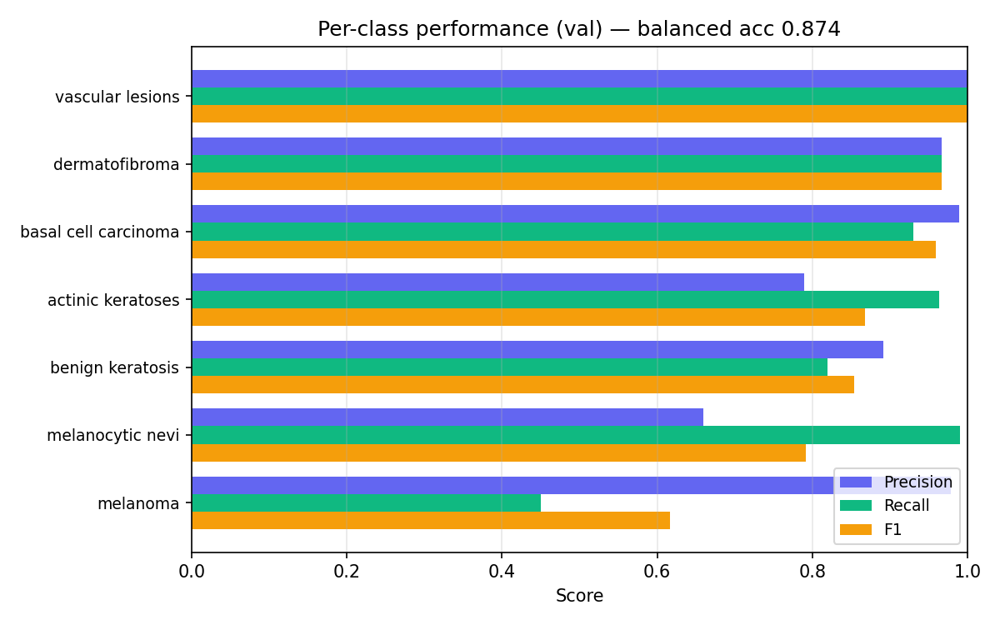
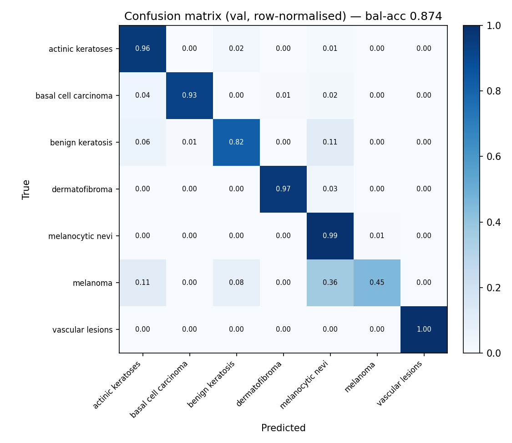
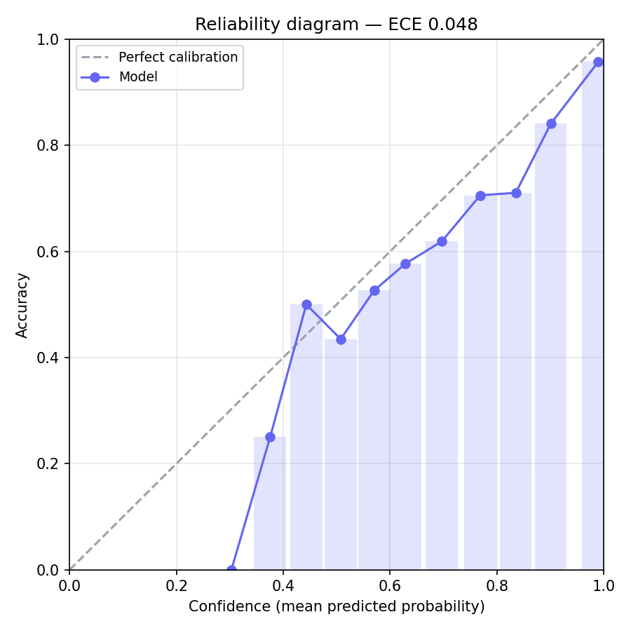
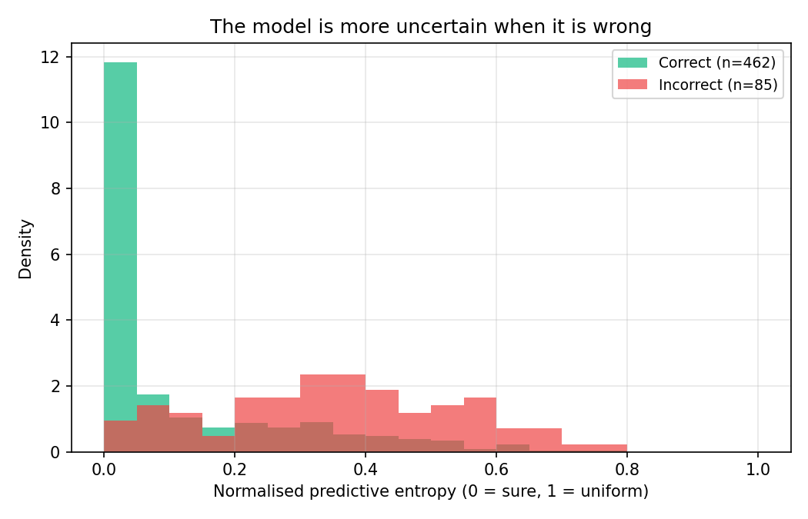
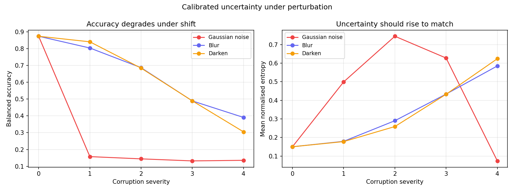

# Skin Lesion Classifier

Transfer learning on dermatoscopic images of skin lesions, with a focus — like
the [galaxy project](../README.md) next door — on **whether the model's
confidence can be trusted**, not just how often it is right. A fine-tuned
EfficientNet classifies a lesion into one of seven HAM10000 categories; an
offline analysis then measures how well-calibrated those probabilities are and
how they behave when the image is degraded.

> ⚠️ **Not medical advice.** This is a research/education demo trained on
> dermatoscope imagery (polarised light, ~10× magnification). Ordinary
> phone-camera photos are out of distribution, so predictions on them are
> unreliable by construction. See a dermatologist for anything real.

---

## Table of contents

- [The task](#the-task)
- [Dataset](#dataset)
- [Model architecture](#model-architecture)
- [Training recipe](#training-recipe)
- [Results](#results)
- [Calibration & uncertainty](#calibration--uncertainty)
- [Robustness under perturbation](#robustness-under-perturbation)
- [The web app](#the-web-app)
- [Running it yourself](#running-it-yourself)
- [Files](#files)

---

## The task

Given a cropped dermatoscopic image, predict which of seven lesion types it is:

| Class | Plain name | Risk tier |
|-------|------------|-----------|
| `melanoma` | Melanoma | malignant |
| `basal_cell_carcinoma` | Basal cell carcinoma | malignant |
| `actinic_keratoses` | Actinic keratosis | pre-cancerous |
| `melanocytic_nevi` | Melanocytic nevus (mole) | benign |
| `benign_keratosis-like_lesions` | Benign keratosis | benign |
| `dermatofibroma` | Dermatofibroma | benign |
| `vascular_lesions` | Vascular lesion | benign |

The interesting part is not raw accuracy but **calibration**: a model that says
"90% melanoma" should be right about 90% of the time, and it should grow visibly
*unsure* when shown a degraded or out-of-distribution image. We measure both.

## Dataset

[HAM10000](https://www.kaggle.com/datasets/kmader/skin-cancer-mnist-ham10000)
("Human Against Machine with 10000 training images"), streamed from the
[`marmal88/skin_cancer`](https://huggingface.co/datasets/marmal88/skin_cancer)
Hugging Face mirror so the full ~6 GB is never stored locally.

HAM10000 is heavily imbalanced — melanocytic nevi alone are ~67% of it — so the
default subset **caps each class** to rebalance the training signal, and the
validation split is capped for a clean, comparable metric. Two countermeasures
keep the rare-but-dangerous classes from being ignored: a **class-weighted
loss** and **balanced accuracy** (mean per-class recall) as the headline metric.

| Class | Train | Val |
|-------|------:|----:|
| actinic_keratoses | 315 | 82 |
| basal_cell_carcinoma | 487 | 100 |
| benign_keratosis-like_lesions | 500 | 100 |
| dermatofibroma | 110 | 30 |
| melanocytic_nevi | 500 | 100 |
| melanoma | 500 | 100 |
| vascular_lesions | 136 | 35 |
| **Total** | **2,548** | **547** |

Images are stored with their short side resized (LANCZOS) so that later
resize/crop never has to upscale. The Colab notebook can instead pull the
**full** training set (`FULL_DATASET = True`) — the class-weighted loss still
compensates for the imbalance.

## Model architecture

The classifier is an **ImageNet-pretrained EfficientNet** with its 1000-class
head replaced by a fresh 7-class linear layer. Two backbones are in play:

| | Currently trained | Notebook default (to train next) |
|---|---|---|
| Backbone | **EfficientNet-B3** | **EfficientNetV2-S** |
| Input resolution | 300×300 | 384×384 |
| Parameters | ~12 M | ~21 M |
| Val balanced acc | **0.874** | _(not yet run)_ |

### Why EfficientNet

EfficientNet uses **compound scaling** — depth, width, and input resolution are
scaled together by a single coefficient rather than independently — so each step
up the family (B0 → B3 → …) buys accuracy at a near-optimal parameter/FLOP cost.
The backbone is built from **MBConv** blocks (inverted residuals with depthwise
separable convolutions and squeeze-and-excitation attention), which are cheap
relative to their representational power — ideal for fine-tuning on a small
medical dataset where a heavier model would simply overfit.

**EfficientNetV2-S** (the configured next model) improves on this with
**Fused-MBConv** blocks in the early stages (a regular 3×3 conv replaces the
expand + depthwise pair, which is faster on modern accelerators) and a training
recipe designed for higher resolutions — hence the move to 384px, EfficientNetV2-S's
native size.

### Generic, swappable head

Rather than hard-code EfficientNet's `classifier[1]`, the head swap is
**architecture-agnostic** (`skin/skin_model.py::replace_head`): it locates the
last `nn.Linear` in whichever head container the backbone uses
(`.classifier` for EfficientNet/ConvNeXt, `.head` for Swin, `.heads` for ViT,
`.fc` for ResNet) and replaces it with a `Linear(in_features → 7)`. This means
you can set `MODEL_NAME = "convnext_small"` / `"swin_v2_t"` / `"vit_b_16"` in the
notebook and everything downstream — training, the app, the analysis — adapts
with no code changes. The app rebuilds the exact trained architecture by reading
`results/model_config.json`.

### Input pipeline

Inputs are normalised with ImageNet statistics (mean `[0.485, 0.456, 0.406]`,
std `[0.229, 0.224, 0.225]`) since the backbone was pretrained that way.
Evaluation resizes the short side to `round(img_size · 256/224)` then
centre-crops to `img_size`, preserving the 256/224 ratio of the standard
ImageNet eval recipe. Training adds light augmentation: random-resized crop,
horizontal **and vertical** flips (lesions have no canonical orientation), and
mild colour jitter.

## Training recipe

Standard **two-phase transfer learning**, run on a free **Colab TPU** via
PyTorch/XLA (`skin/colab_training.ipynb`):

1. **Head warm-up** — freeze the pretrained backbone, train only the new
   7-class head for a few epochs. This stops the randomly-initialised head from
   sending large, destructive gradients back through the good pretrained
   features.
2. **Full fine-tune** — unfreeze everything and train at a low learning rate,
   with **early stopping** on validation balanced accuracy (patience 6), so you
   can set the epoch budget high and only pay for the epochs that actually help.

| Hyperparameter | Value |
|---|---|
| Loss | class-weighted cross-entropy |
| Optimiser | AdamW |
| Head LR / fine-tune LR | 1e-3 / 1e-4 |
| Head epochs / fine-tune epochs | 3 / up to 40 (early-stopped) |
| Batch size | 24 (V2-S @ 384 on one TPU core) |
| Selection metric | validation balanced accuracy |

The best checkpoint (by val balanced accuracy) is saved every time it improves,
so a disconnect or early stop always leaves the best weights on disk. A local
Apple-GPU (MPS) fallback (`02_finetune.py`, EfficientNet-B0) exists for when no
TPU is available.

## Results

The current **EfficientNet-B3** reaches **0.845 accuracy / 0.874 balanced
accuracy** on the 547-image validation set.





Per-class F1 ranges from a perfect 1.00 on vascular lesions down to 0.62 on
melanoma. The most clinically important caveat is in that last number:

> **Melanoma recall is only 0.45** — the model *misses* over half of melanomas,
> usually confusing them for benign nevi or keratoses. Its melanoma **precision**
> is high (0.98), so when it *does* call melanoma it is almost always right, but
> it is far too conservative about raising the alarm. A real screening tool would
> need to trade precision for recall here (e.g. a lower decision threshold or a
> recall-weighted loss). This is exactly why the app foregrounds the full
> probability distribution and an uncertainty warning rather than a single label.

## Calibration & uncertainty

Are the predicted probabilities trustworthy? The reliability diagram bins
predictions by confidence and plots confidence against actual accuracy; a
perfectly calibrated model sits on the diagonal.



**Expected Calibration Error is 0.048** — well-calibrated, though the curve sits
just below the diagonal, meaning the model is mildly **overconfident**. Post-hoc
**temperature scaling** (as in the galaxy project's task 7) would tighten this.

A second view: predictive entropy (normalised to [0, 1]) split by whether the
prediction was correct. A useful uncertainty signal should be low when the model
is right and high when it is wrong.



It is: mean entropy is **0.11 on correct** predictions vs **0.36 on incorrect**
ones. The app uses this same entropy to show a "low confidence" warning.

## Robustness under perturbation

The headline experiment. We corrupt the validation images with increasing
severity along three axes — additive Gaussian noise, blur, and darkening — and
track both balanced accuracy and mean uncertainty. A *trustworthy* model should
become **less accurate and more uncertain together**, so that low confidence
flags the degraded inputs.



- **Blur and darkening behave correctly**: accuracy falls and uncertainty rises
  in step, so the entropy signal would catch these degraded images.
- **Gaussian noise breaks it**: accuracy collapses to chance (~0.14 for 7
  classes) while uncertainty actually **drops** — the model becomes *confidently
  wrong*. This is the dangerous failure mode for any confidence-gated system: the
  one corruption the uncertainty signal does **not** catch. The natural fix is to
  add Gaussian noise to the training augmentation so the model learns to distrust
  it.

This is the same "calibrated uncertainty under perturbations" question the galaxy
project studies, reproduced on a medical-imaging model — including a clean
example of where it fails.

## The web app

`03_app.py` is a [Gradio](https://www.gradio.app/) app. Upload or capture a
photo and it returns a risk-tiered verdict card (colour-coded benign /
pre-cancerous / malignant), the top-3 class probabilities, and a low-confidence
warning driven by the normalised entropy above. It rebuilds whatever
architecture was trained by reading `results/model_config.json`, so it works
unchanged whether the checkpoint is B3, V2-S, or a ConvNeXt/Swin/ViT you train
later.

## Running it yourself

From the `skin/` directory (everything here uses `__file__`-relative paths and
shares the repo's `uv` environment):

```bash
cd skin
uv run python 01_data.py      # stream + save the balanced subset (~10 min, one-time)
uv run python 02_finetune.py  # local two-phase fine-tune on Apple GPU (MPS) — fallback
uv run python 03_app.py       # web app: open on your phone over WiFi, upload a photo
uv run python 04_analysis.py  # offline calibration + robustness analysis (no Colab)
```

For the better TPU-trained model, open `colab_training.ipynb` in Google Colab
(**Runtime → TPU → Run all**), then download the contents of Drive's
`galaxy-uq/results/skin/` into `skin/results/`. To experiment, change
`MODEL_NAME` / `IMG_SIZE` / the learning rates in the config cell — the head swap
and freeze logic are generic, so any torchvision classifier works.

Tests (run from the repo root):

```bash
uv run pytest skin/tests/
```

## Files

```
skin/
├── 01_data.py            # stream HAM10000 subset from Hugging Face -> data/
├── 02_finetune.py        # local EfficientNet-B0 fine-tune on Apple GPU (fallback)
├── 03_app.py             # Gradio web app (reads results/model_config.json)
├── 04_analysis.py        # offline calibration + robustness analysis
├── skin_model.py         # shared helpers: head-swap, model rebuild, preprocessing, entropy
├── colab_training.ipynb  # TPU training (EfficientNetV2-S default; architecture-agnostic)
├── tests/                # unit tests for the shared helpers
├── data/                 # train/ and val/ image folders (gitignored)
└── results/              # checkpoints, configs, logs (gitignored)
    └── figures/          # analysis figures (git-tracked)
```

`data/` and most of `results/` are gitignored (large / regenerable); only
`results/figures/` is tracked. The app reads `results/model_config.json` to
rebuild whatever architecture was trained, so it adapts to any backbone with no
code changes.
