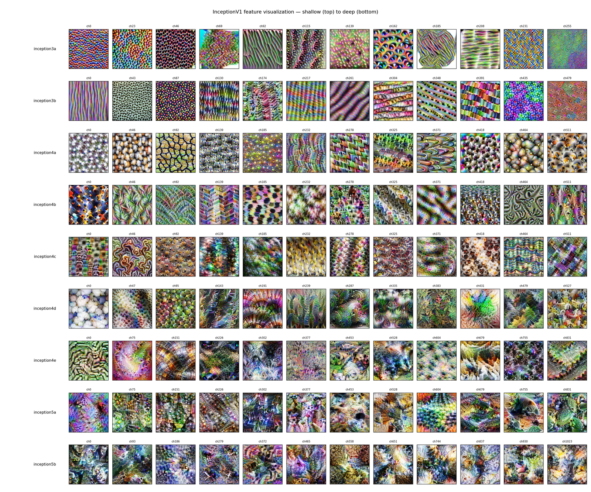
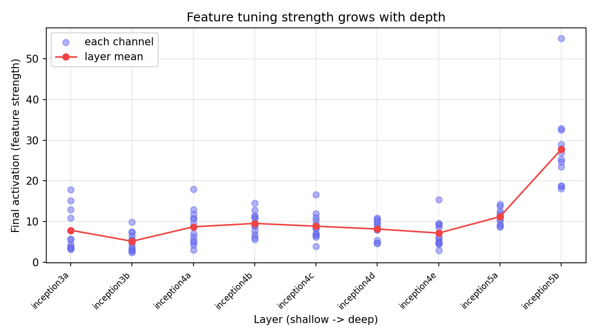
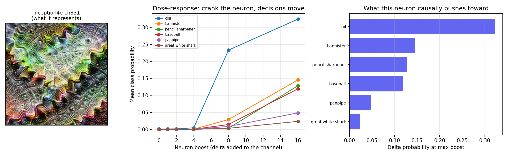
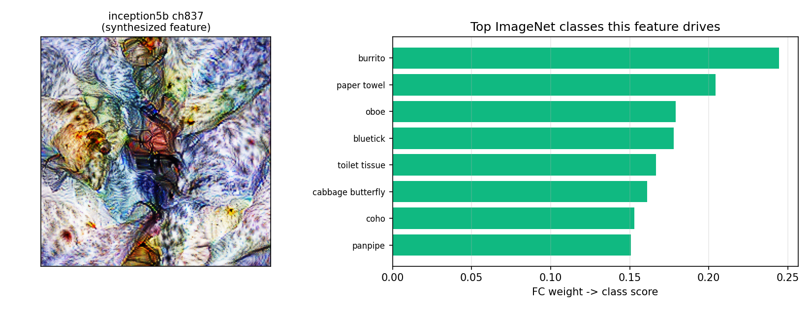
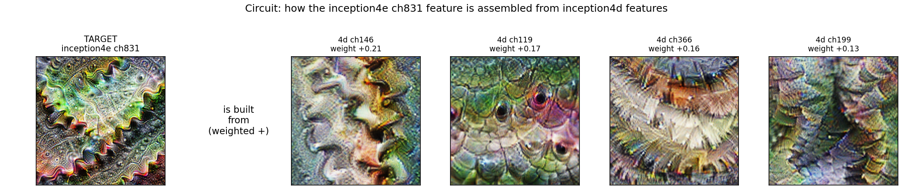
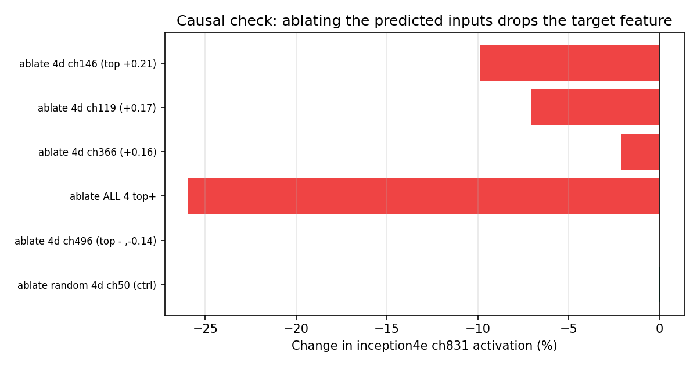
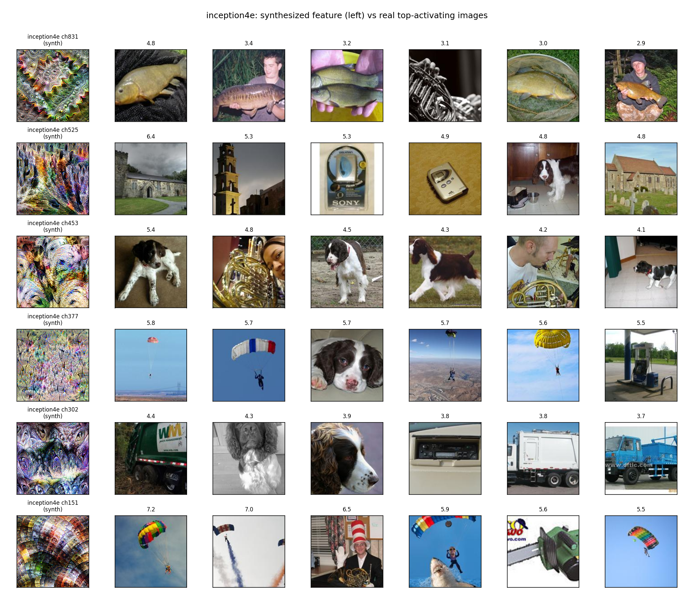
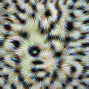

# Mechanistic interpretability — working report

*A living document. It grows as the project does; see the changelog at the bottom.*

**Last updated:** 2026-07-02 · **Status:** InceptionV1 warm-up complete; skin-model application next.

---

## What this is, in one paragraph

Modern image classifiers are neural networks: millions of numbers ("weights") that
somehow turn a photo into a label. Normally we treat them as black boxes — they work,
but we don't know *why*. **Mechanistic interpretability** is the project of opening the
box and reading the actual machinery: finding the individual parts inside the network,
what each part detects, and how the parts wire together into the final decision. This
report documents that process, done from scratch on a real network.

We start not on our medical model but on **InceptionV1** (a.k.a. GoogLeNet) — the classic
network the interpretability field cut its teeth on. It is small enough to run on a
laptop and clean enough to read. Once the techniques are trusted here, we point the same
toolkit at the skin-lesion classifier.

Everything below was computed by our own code against the public, ImageNet-trained
InceptionV1 weights. Nothing is hand-drawn or hard-coded (see *"Is this real?"*).

---

## The mental model

Think of the network as a tall stack of layers. The bottom layers see raw pixels; each
layer above combines the layer below into something slightly more abstract. A useful
analogy: bottom layers detect **edges and colours**, middle layers assemble those into
**textures and patterns**, and top layers assemble those into **object parts**. A single
"channel" (also called a neuron or a unit) in a layer is one detector. Our job is to
figure out what each detector detects, and how.

We use **four complementary lenses**. Any one alone can mislead; when they agree, we
trust the result.

---

## Lens 1 — Feature visualization: *what does a detector look for?*

We can literally ask a single detector: "what image would excite you most?" Starting from
random static, we nudge the pixels — thousands of tiny steps — until the detector fires as
hard as possible. The result is that detector's ideal stimulus, grown from noise.

Running this across the network, shallow layers (top) to deep layers (bottom):

The story reads top-to-bottom exactly as the mental model predicts:

- **Shallow** (`inception3a/3b`): simple stripes, colour gradients, fine gratings.
- **Middle** (`inception4a–4c`): organised textures — weaves, honeycombs, scales.
- **Deep** (`inception4e/5b`): elaborate, almost object-like structures.

This simple → complex progression is *the* foundational result of the field, and here we
reproduced it ourselves.

### A measurable version of the same thing

Feature strength (how hard the strongest detector can be driven) grows with depth — the
qualitative montage, turned into a number:

---

## Lens 2 — Interventions: *what does a detector actually do?*

Lens 1 shows what a neuron *represents*. That's a correlation. To prove a neuron *matters*,
we intervene: reach inside, **turn one neuron up**, and watch how the network's final
answer changes. (This is the same idea behind "Golden Gate Claude", where one feature was
clamped high.)

Cranking a single mid-network neuron (`inception4e`, channel 831) and measuring the effect
on the 1000 possible output categories:

As we turn the knob up, the probability of "coil" rises from near-zero to 0.33, with
"bannister", "pencil sharpener" and "baseball" following. The decision *moves* in a
specific, repeatable direction — causal proof that this neuron drives those outputs.
Crucially the neuron sits in a *middle* layer, so its effect passes through several more
layers before the output: it cannot be read off any single weight, only revealed by the
intervention.

### Which decisions a detector feeds

The network's very last layer is a simple weighted vote from the deepest detectors to the
1000 category scores. Reading those weights for one deep detector shows exactly which
categories it votes for:

Note the categories are unrelated (burrito, oboe, a dog breed…). A single neuron serving
many unrelated concepts is called **polysemanticity** — one of the field's central and
still-open findings, visible here directly.

---

## Lens 3 — Circuits: *how is a detector built?*

A deep detector is assembled from simpler ones below it. Because InceptionV1's wiring is
readable, we can trace it: for our `4e` "coil" detector, we read the weights and render
the four `inception4d` detectors that feed it most:

Every input is a ribbed / wavy / curved-ridge texture. The network builds the complex
"coil" detector by adding up simpler ridge detectors — a real circuit, straight from the
weight matrix.

### Verifying the circuit causally

Weights show the wiring; they don't prove the network *uses* it. So we test it: remove
(zero out) each predicted input and measure what happens to the "coil" detector.

Removing the four predicted inputs drops the detector by **26%**; removing a *random*
detector does nothing (0%). Wiring and behaviour agree — a verified circuit.

---

## Lens 4 — Dataset examples: *does it match real photos?*

Finally, the honesty check: among real photographs, which ones actually fire the detector?
If the real images match the synthesized guess, the label is trustworthy. Left column is
the synthesized feature; the rest are the real top-firing photos:

Some detectors line up cleanly (channel 831 fires on **fish** — whose curved, ribbed,
scaled bodies match the "coil" texture); others look genuinely mixed. This lens keeps the
synthesized story honest — it confirms some detectors and exposes others as polysemantic.

> **Caveat:** the real-image set here (Imagenette) has only 10 categories, so a detector's
> true favourite may simply be absent. A more diverse image set is a planned improvement.

---

## Case study: neuron `inception4e` channel 831, fully characterised

Putting all four lenses on one neuron — the whole point of the method is that independent
techniques converge:

| Lens | Finding |
|------|---------|
| Feature visualization | a coiled / ribbed spiral texture |
| Intervention | causally pushes the output toward *coil, bannister, pencil sharpener* |
| Circuit + ablation | built from `4d` ribbed/wave detectors; removing them drops it 26% |
| Dataset examples | fires hardest on real fish (curved, ribbed bodies) |

Four independent methods, one coherent answer: **a curved/ribbed/spiral-texture
detector.** That convergence is what "understanding a neuron" means.

---

## Is this real? (a fair question)

The only thing we did not compute is the network itself: InceptionV1's weights were
trained by others on **ImageNet** (1.2M photos, 1000 human-defined categories such as
"great white shark"). Those category names come bundled with the weights — they are the
fixed vocabulary the network was trained to predict, not something invented here.

Everything visual in this report was *computed*, not stored. To demonstrate, we re-ran one
feature visualization from a fresh random seed: its activation climbed from **0.82 → 11.24**
during optimization. A stored or hard-coded image would start high and never change; this
grows from noise every time.

---

## How to reproduce

All local pieces run on a laptop (no GPU) from the `skin/` directory:

- `mech-interp/00_inceptionv1_featureviz.py` — feature visualization montage (Lens 1).

The heavier, GPU pieces run as self-contained Kaggle notebooks (no data upload needed —
they download what they need):

- `mech-interp/inceptionv1_kaggle.ipynb` — large feature-visualization gallery.
- `mech-interp/inceptionv1_dataset_examples_kaggle.ipynb` — dataset examples (Lens 4).

The intervention, circuit, ablation and feature→class analyses were run locally as
one-off scripts; they will be consolidated into a tracked script in a future update.

---

## Roadmap

1. ✅ **InceptionV1 warm-up** — all four lenses working and cross-validated (this report).
2. ⬜ **Cleaner dataset examples** — swap Imagenette for a more diverse image set.
3. ⬜ **Point the toolkit at the skin-lesion model** — which learned features drive each
   diagnosis; are any dermatologically meaningful (border, colour, vascular pattern)?
4. ⬜ **Concepts & sparse autoencoders** — decompose polysemantic neurons into cleaner
   concepts.

---

## Changelog

- **2026-07-02** — Initial report. InceptionV1: feature visualization, depth analysis,
  interventions, feature→class, circuit tracing + causal ablation, and dataset examples.
  Case study on neuron `4e:831`.
